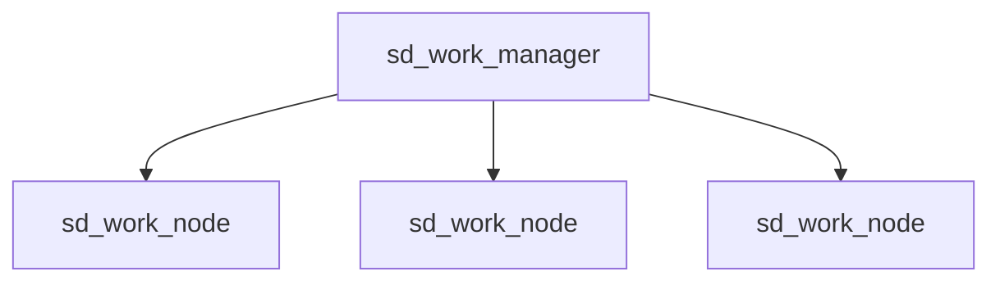

# sd_work_node

`Stable diffusion`模型计算节点。

提供下述功能：
- Tex2Img（仅 DDIM 采样器）
- Img2Img（仅全图）
- Upscale（仅 ESRGan）



基于`Work-stealing`模式设计，可以多点部署，需要与`sd_work_manager`交互，对外功能由`sd_work_manager`提供。

## 安装依赖

```
python3 -m venv venv
source venv/bin/activate
pip install -r requirements.txt
```

由于`CLIP`安装脚本对`torch`、`numpy`等存在依赖，可能需要分两次对依赖进行安装。

## 运行环境

- Python >= 3.9
- CUDA / MPS (Apple M1芯片)

针对 M1 芯片，需要在安装 `requirements.txt` 内容后手工执行：

```
pip uninstall torch torchvision torchaudio -y
pip install --pre torch==1.13.0.dev20220922 torchvision==0.14.0.dev20220924 -f https://download.pytorch.org/whl/nightly/cpu/torch_nightly.html --no-deps
cd venv/src/latent-diffusion
git apply ../../../ldm.patch
```

以获取硬件加速支持。

## 启动

```bash
python3 ./main.py --config config.json --verbose
```

### 参考配置文件

- config.json

```json
{
  "device": {
    "half_precision": false,
    "memory_level": 0
  },
  "model": {
    "model_config_path": "./data/config.yaml",
    "model_check_point_path": "./data/model.ckpt",
    "model_vae_path": "./data/model.vae.pt"
  },
  "manager_url": "http://localhost:17059",
  "hypernetwork_dir": "./data/modules",
  "secret": ""
}
```

| 配置项                           | 说明                                                                             |
|-------------------------------|--------------------------------------------------------------------------------|
| device.half_precision         | 指定是否使用半精度（float16），适用于显存不足的环境。                                                 |
| device.memory_level           | 显存级别（0：高显存，不启用任何显存优化，速度最快；1：中显存，适用于不超过 6GB 的显卡，启用少量优化以减少显存占用；2：低显存，适用于 4GB 设备） |
| model.model_config.path       | 模型配置文件路径                                                                       |
| model.model_check_point_path  | 模型 Checkpoint 文件路径                                                             |
| model.model_vae_path          | （可选）VAE 文件路径                                                                   |
| model.using_penultimate_layer | （可选）是否启用 CLIP 网络中倒数第二层的推导结果，默认 False                                           |
| model.embedding_dir_path      | （可选）指定存放 Texture Inversion 计算所得 embedding 的目录                                  |
| manager_url                   | 管理节点 URL                                                                       |
| url_path_prefix               | （可选）URL前缀，默认'/api'                                                         |
| secret                        | 到管理节点通信所用的密钥                                                                   |
| hypernetwork_dir              | （可选）指定存放 Hypernetwork 的文件夹                                                     |

## 许可

本项目代码使用部分来自 [stable-diffusion-webui](https://github.com/AUTOMATIC1111/stable-diffusion-webui) 中的代码，鉴于原始项目[不具备明确的 LICENSE](https://github.com/AUTOMATIC1111/stable-diffusion-webui/issues/2059)，故尚未能为本项目添加对应的 LICENSE。

在这种情况下，使用本项目代码所造成的一切后果需要您自行承担。
